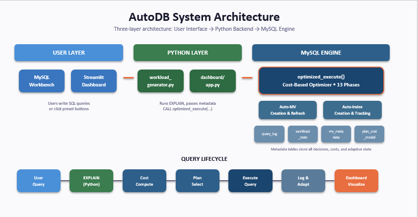
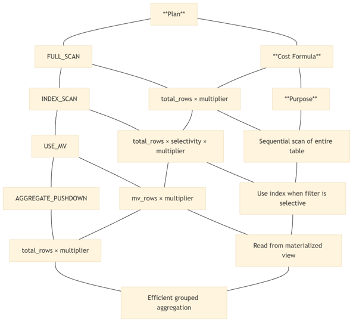
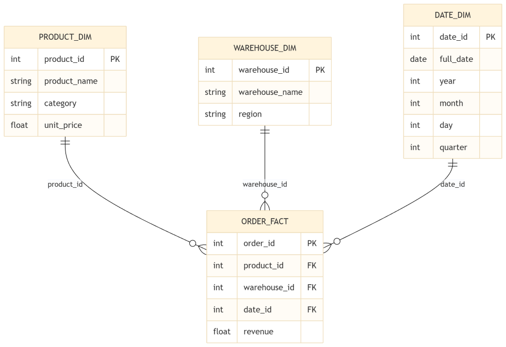
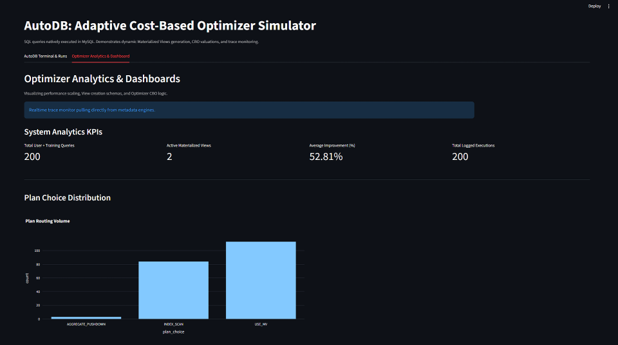

# AutoDB 
### A Self-Adaptive Cost-Based Query Optimization System for Dynamic Database Workloads

<p align="center">
  
  
  
  
</p>

<p align="center">
AutoDB is a self-adaptive Cost-Based Query Optimizer built on top of MySQL that continuously learns from query execution history to improve future execution plans. The system combines adaptive cost modeling, automatic index creation, workload analysis, materialized view generation, and an interactive Streamlit dashboard to demonstrate modern database optimization techniques.
</p>

---

#  Project Overview

Traditional database query optimizers rely on **static cost models** and predefined heuristics to select execution plans. While these approaches work well for stable workloads, they fail to adapt when query patterns evolve, causing repeated execution of suboptimal plans.

AutoDB addresses this limitation by introducing an adaptive optimization layer that continuously monitors query execution, learns workload characteristics, updates its internal cost model using runtime feedback, and automatically creates indexes and materialized views whenever beneficial.

The project demonstrates how adaptive query optimization can be implemented primarily using **MySQL Stored Procedures**, supported by a lightweight Python backend and an interactive Streamlit dashboard for visualization and experimentation.

---

#  Features

-  Adaptive Cost-Based Query Optimization
-  Automatic Query Fingerprinting
-  Runtime Feedback Learning
-  Dynamic Cost Model using Exponential Moving Average (EMA)
-  Automatic Index Creation
-  Automatic Materialized View Creation
-  Query Workload Pattern Analysis
-  Metadata-Driven Learning
-  Multiple Execution Plan Competition
-  Interactive Streamlit Dashboard
-  Real-Time Query Analytics
-  Performance Monitoring

---

#  System Architecture

<p align="center">

</p>

AutoDB follows a **three-layer architecture**:

- **User Layer**
  - Streamlit Dashboard
  - MySQL Workbench

- **Python Layer**
  - Query preprocessing
  - Workload generation
  - EXPLAIN extraction
  - Dashboard visualization

- **Database Layer**
  - MySQL Stored Procedures
  - Adaptive Cost-Based Optimizer
  - Automatic Index Creation
  - Materialized View Management
  - Metadata Management

---

#  How AutoDB Works

Every submitted SQL query passes through the following pipeline.

<p align="center">

</p>

### Query Processing Pipeline

1. User submits an SQL query.
2. Query is normalized and fingerprinted.
3. Workload statistics are updated.
4. Query type is classified.
5. Auto-tuning checks are performed.
6. Multiple execution plans are evaluated.
7. Lowest-cost execution plan is selected.
8. Query is executed.
9. Runtime statistics are collected.
10. Adaptive cost model is updated.
11. Results are visualized on the dashboard.

---

#  Adaptive Optimizer Workflow

```text
User Query
      │
      ▼
 EXPLAIN Extraction
      │
      ▼
 Query Classification
      │
      ▼
 Cost Competition
 ┌─────────────────────────────┐
 │ FULL_SCAN                   │
 │ INDEX_SCAN                  │
 │ USE_MATERIALIZED_VIEW       │
 │ AGGREGATE_PUSHDOWN          │
 └─────────────────────────────┘
      │
      ▼
 Cheapest Plan Selected
      │
      ▼
 Query Execution
      │
      ▼
 Runtime Feedback
      │
      ▼
 Cost Model Update (EMA)
      │
      ▼
 Improved Future Plans
```

---

#  Adaptive Cost Model

Instead of relying on static assumptions, AutoDB evaluates multiple execution strategies before selecting the optimal plan.

| Execution Plan | Cost Formula |
|----------------|-------------|
| FULL_SCAN | Total Rows × Multiplier |
| INDEX_SCAN | Total Rows × Selectivity × Multiplier |
| USE_MATERIALIZED_VIEW | Materialized View Rows × Multiplier |
| AGGREGATE_PUSHDOWN | Total Rows × Multiplier |

The optimizer continuously updates these multipliers using an **Exponential Moving Average (EMA)**.

```text
new_cost = 0.8 × old_cost + 0.2 × observed_runtime
```

This adaptive learning process enables AutoDB to improve execution plan selection over time while maintaining optimizer stability through bounded multiplier updates.

---

#  Database Schema


<p align="center">

</p>

The optimizer is evaluated on an analytical star-schema database consisting of:

- Order Fact Table
- Product Dimension
- Warehouse Dimension
- Date Dimension

This schema supports analytical workloads involving aggregation, filtering, and reporting queries.

---

#  Optimizer Metadata

AutoDB maintains several metadata tables that serve as the optimizer's learning memory.

| Metadata Table | Purpose |
|----------------|---------|
| **query_log** | Stores execution history and performance metrics |
| **workload_stats** | Tracks repeated query patterns |
| **column_stats** | Stores column selectivity statistics |
| **plan_cost_model** | Maintains adaptive plan multipliers |
| **index_metadata** | Tracks automatically created indexes |
| **mv_metadata** | Maintains materialized view information |

---

#  Dashboard

<p align="center">

</p>

The interactive Streamlit dashboard provides:

- SQL Query Executor
- Benchmark Execution
- Execution Plan Viewer
- Query Logs
- Performance Analytics
- Cost Model Visualization
- Plan Distribution Charts
- Adaptive Learning Statistics

---

#  Experimental Results

After executing a workload of approximately **200 training queries**, AutoDB demonstrates progressive learning and improved execution plan selection.

| Execution Plan | Percentage |
|---------------|-----------:|
| USE_MATERIALIZED_VIEW | **54.5%** |
| INDEX_SCAN | **42.0%** |
| AGGREGATE_PUSHDOWN | **2.5%** |
| FULL_SCAN | **1.0%** |

Observed optimizer evolution:

```text
FULL_SCAN
      │
      ▼
INDEX_SCAN
      │
      ▼
USE_MATERIALIZED_VIEW
```

This transition validates the effectiveness of adaptive learning and runtime feedback.

---

#  Technology Stack

| Component | Technology |
|------------|------------|
| Programming Language | Python |
| Database | MySQL 8.0 |
| Backend | SQL Stored Procedures |
| Frontend | Streamlit |
| Data Processing | Pandas |
| Database Connectivity | SQLAlchemy |
| Visualization | Matplotlib / Plotly |

---

## Project Structure

```text
AutoDB/
│
├── backend/
│   ├── optimizer_logic.py
│   └── workload_generator.py
│
├── dashboard/
│   └── app.py
│
├── images/
│   ├── architecture.png
│   ├── dashboard.png
│   ├── pipeline.png
│   └── star_schema.png
│
├── sql/
│   ├── procedures.sql
│   └── setup.sql
│
├── requirements.txt
└── README.md
```

#  Installation

Clone the repository.

```bash
git clone https://github.com/gandhiyash09/autodb.git
```

Move into the project directory.

```bash
cd autodb
```

Create a virtual environment (recommended).

### Windows

```bash
python -m venv venv
venv\Scripts\activate
```

### Linux / macOS

```bash
python3 -m venv venv
source venv/bin/activate
```

Install the required Python packages.

```bash
pip install -r requirements.txt
```

---

#  Running the Project

Start the Streamlit application.

```bash
streamlit run app.py
```

Open your browser and navigate to:

```text
http://localhost:8501
```

---

#  Workflow

1. Launch the Streamlit dashboard.
2. Connect to the MySQL database.
3. Execute SQL queries.
4. AutoDB analyzes the query.
5. Multiple execution plans compete.
6. The lowest-cost plan is selected.
7. Runtime feedback updates the optimizer.
8. Dashboard displays execution statistics and learning progress.

---

#  Future Improvements

- PostgreSQL Support
- SQLite Support
- Machine Learning-Based Cost Prediction
- Automatic Join Reordering
- Distributed Query Optimization
- Cloud Deployment
- Multi-Database Support
- Real-Time Monitoring Dashboard

---

#  Contributors

- **Dhruv Agrawal**
- **Rishabh Hiten Rajgor**
- **Yash N. Gandhi**

---

#  License

This project is developed for academic and educational purposes.

If you found this project useful, consider giving it a ⭐ on GitHub.
